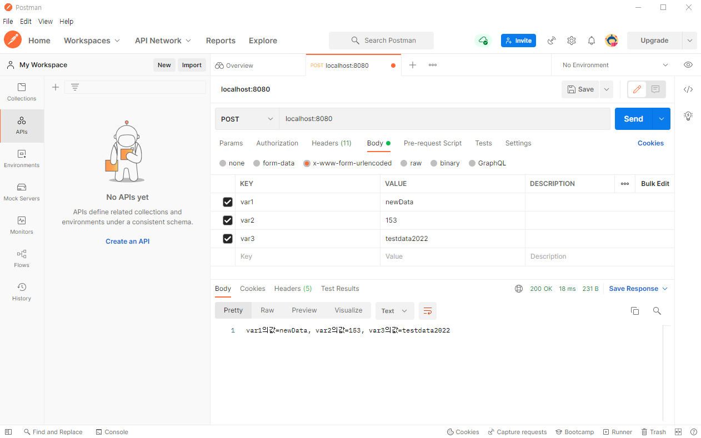

# 클라이언트 요청(POST) 처리

- POST 형태의 요청은 GET과는 요청하는 측의 데이터 구조가 다릅니다.
- GET의 경우는 앞장에서 학습한것과 같이 주소의 끝에 ?(물음표)를 붙이고 뒤에 변수명=값 형태로 요청을 하지만, POST는 주소만 요청하고 변수와 값을 주소가 아닌 요청 BODY에 담아서 서버측에 요청합니다.


### 가. HTTP 프로토콜의 구조

- HTTP 프로토콜은 브라우저에서 서버로 요청(REQUEST) 하거나 서버에서 브라우저로 응답(RESPONSE)할 때 서로 데이터를 주고받게 되는데 이 데이터의 구조는 요청에 대한 설정정보가 담기는 HEADER와 실제 데이터가 담기는 BODY로 구성


- 특정 주소를 서버로 요청시 서버로 전달되는 데이터의 형태

```text
// Request : 실제 자원요청에 대한 정보가 저장되는 부분
POST /request/specific_datas.call HTTP/1.1

// Request Header : 자원요청에 대한 설정정보, 요청하는 데이터타입, 요청자의 브라우저정보 등이 담긴다.            
Accept: image/gif, image/xxbitmap, image/jpeg, image/pjpeg,
application/xshockwaveflash, application/vnd.msexcel,
application/vnd.mspowerpoint, application/msword, */*
Referer: http://wahh-app.com/books/default.asp
Accept-Language: en-gb,en-us;q=0.5
Accept-Encoding: gzip, deflate
User-Agent: Mozilla/4.0 (compatible; MSIE 7.0; Windows NT 5.1)

//Request Data : 실제 전달하고자 하는 데이터가 담긴다
jfhdahiekljdklhfkha=e%3kljfhailjljfljalkjlkfjldjaf
```

- GET의 경우는 가장 윗줄의 주소부분 끝에 ?(물음표) 를 붙이고 필요한 변수와 값을 전달하지만 POST 는 가장 아래의 Request Data에 해당하는 BODY 부분에 데이터를 담아서 전달
- 따라서 node.js 에서 POST 요청에 대한 처리는 GET 처리와는 조금 다른 로직으로 구성


### 나. POST 요청처리

- 프로젝트폴더에 server_request_post.js 파일을 생성하고 아래와 같이 입력하고 서버를 실행


*server_request_post.js*

```js
var http = require('http');
var querystring = require('querystring');

var server = http.createServer(function(request,response){
  // 1. post로 전달된 데이터를 담을 변수를 선언
  var postdata = '';
  // 2. request객체에 on( ) 함수로 'data' 이벤트를 연결
  request.on('data', function (data) {
    // 3. data 이벤트가 발생할 때마다 callback을 통해 postdata 변수에 값을 저장
    postdata = postdata + data;
  });

  // 4. request객체에 on( ) 함수로 'end' 이벤트를 연결
  request.on('end', function () {
    // 5. end 이벤트가 발생하면(end는 한 번만 발생한다) 3번에서 저장해둔 postdata 를 querystring 으로 객체화
    var parsedQuery = querystring.parse(postdata);
    // 6. 객체화된 데이터를 로그로 출력
    console.log(parsedQuery);
    // 7. 성공 HEADER 와 데이터를 담아서 클라이언트에 응답처리
    response.writeHead(200, {'Content-Type':'text/html'});
    response.end('var1의 값 = ' + result);
  });

});

server.listen(8080, function(){
    console.log('Server is running...');
});
```


### 다.브라우저를 통한 요청확인

- 4 장에서 사용했던 동일한 주소로 브라우저를 통해 호출하면 아래와 같은 결과물이 나타남
- POST 는 BODY 부분의 데이터를 처리하기때문에 GET방식으로 주소줄에 넘어온 데이터를 찾을 수 없어서 undefined 라는 메시지가 출력(나는 웹페이지에서는 안뜨고 cmd에서 뜸)


- 값이 정상적으로 처리되기 위해서는 POST 형태로 데이터를 요청해야 함
- POST 데이터 요청을 위해서 HTML 의 form 태그를 사용할 수도 있지만 이 강좌에서는 크롬의 플러그인 중에 하나인 POSTMAN 이라는 툴을 사용


### 라.POSTMAN 설치

- 크롬의 우측상단 메뉴에서 도구 더보기 > 확장 프로그램(E) 를 클릭하면 나타나는 화면을 아래로 스크롤 하면 하단에 [더 많은 확장 프로그램 다운로드]라는 버튼이 보입니다. 클릭해서 해당 화면으로 이동


- 크롬 웹스토어에서 postman 으로 검색하면 아래와 같은 앱(확장프로그램이 아닙니다) 이 검색됩니다. 크롬에 추가(나는 멀캠 수업과정 때 따로 다운받음)


### 마.POSTMAN을 통한 서버요청

- 아래와 같이 POSTMAN을 실행하고 주소와 POST 요청값을 입력한 후 서버로 요청
  1. 먼저 요청방식을 GET 에서 POST로 변경합니다.
  2. 요청할 서버주소 localhost:8080 을 입력합니다.
  3. 요청할 데이터 영역중에 Body를 선택합니다.
  4. Body 전달하는 데이터의 성격을 정합니다. 가장 앞에 form-data가 아니고 두번째 x-www-form-urlencode를 선택합니다. form-data 는 데이터의 구조가 조금 다릅니다.
  5. var1, var2, va3 에 해당하는 변수와 값을 입력합니다.
  6. Send 버튼을 클릭해서 서버로 요청하고 결과를 확인합니다.


- 위의 그림과 같이 결과화면에 var1의 값이 출력


> ⁉point
>
> 해당 예제에서는 var1~3까지 값을 넣어줬는데 server_request_post.js 파일에서 **response.end('var1의 값 = ' + result);** 라고 작성한 코드를 아래 코드
>
> **response.end('var1의값=' + parsedQuery.var1 + ', var2의값=' + parsedQuery.var2 + ', var3의값=' +parsedQuery.var3);**
>
> 로 바꿔주지 않아서 에러가 발생




### 바.소스코드분석

- 다른 부분은 GET에서 처리했던 부분고 로직의 구조가 차이가 없는데 POST처리에서 가장 특징적인 부분은 event 처리

- node.js는 일반적인 웹서버의 thread 동기방식이 아닌 비동기 event 방식으로 데이터를 처리
  - on( ) 함수를 사용해서 event를 등록하고 해당 event가 발생하는 시점에 로직을 실행하는 구조가 가장 대표적인 event 처리를 위한 코드

- 아래의 소스 코드를 보면 request 객체에 on 함수를 사용해서 'data' 라는 이벤트를 catch 함
  - 비슷한 구조로는 server.listen( ) 이라는 형태로 서버를 구동시키는 함수가 있는데 둘 사이의 차이점은 listen 과 다르게 on은 이벤트의 명칭을 정의한다는 것
  - 이로 인해서 특정 이벤트가 발생해야지만 해당 이벤트가 발생한 시점에 로직을 실행시키게 되는 것

```
request.on('data', function (data) {
    // request 객체에서 data 이벤트가 발생하면 data 변수를 callback 함수에 담아서 내부 로직을 실행합니다.
});
```


- 같은 형태로 end 이벤트도 처리할 수 있는데 data 이벤트는 전송하는 데이터의 크기가 길 경우 여러번에 나누어서 발생하지만 end 이벤트는 data 전송이 완료되었을 때 한 번만 발생

- 그래서 아래와 같이 코딩을 하면 위의 data 이벤트가 완료되고 아래의 end 이벤트가 발생하므로 순차적으로 실행

```
request.on('end', function () {
    // request 객체에서 end 이벤트가 발생하면 내부 로직을 실행합니다. end 이벤트는 callback 시에 전달되는 값이 없습니다.
});
```

- 이벤트를 등록하게 되면 마치 하나의 서버처럼 이벤트가 발생할 때까지 해당 로직이 대기 
  - 그리고 로직의 순서와는 상관없이 이벤트가 발생했을 때만 동작

