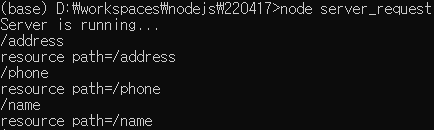

# URL 다루기

이번장에서는 url 모듈을 사용해서 node.js 서버로 들어온 자원(주소)요청을 처리하는 방법을 알아보겠습니다. 소개에서 설명했듯이 외부모듈은 되도록 배제하고 기본모듈인 url을 사용해서 처리하도록 하겠습니다.


### 가. 서버URI(디렉토리 + 파일)

- url모듈은 클라이언트가 요청한 주소를 parsing해서 서버내의 실제 로컬자원만 따로 처리할 수 있게 해줍니다. 기존 URL 주소체계에서의 서버리소스는 디렉토리 + 파일의 형태였으나 RESTful이 표준화된 지금은 특정도메인 서버가 가지는 유일한 리소스를 식별하는 서버식별자라고 표현하는게 더 적절할것 같습니다.

- 이 강의에서는 아래와 같은 구조의 url 요청에서 도메인명 다음의 "/" 문자부터 쿼리스트링인 "?" 이전까지의 문자열인 path 값을 사용해서 요청한 서버URI를 클라이언트측에 전달하도록 하고, 정의되어 있지 않은 요청이 들어오면 "404 Page Not Found" 메시지를 전달하도록 하겠습니다.


- 서버 URI에 해당하는 문자열

```
http://www.naver.com/my_page/firstpage?section=15 // 전체 URI

[ http://www.naver.com ] [ /my_page/firstpage ] [ ?section=15 ]
        도메인                  서버URI           쿼리스트링
```

- 개념적으로는 다른의미이지만 이런 서버URI에 해당하는 문자열을 가져오는 함수명들이 몇몇 언어에서 getRequestURI( ) 형태로 이미 정의되어 있기 때문에 이 강좌에서도 그냥 서버URI 라고 하겠습니다. 하지만 실제 URI 의 개념은 URL보다 더 큰 범위로 URL 처럼 도메인명과 프로토콜을 포함하기 때문에 공식문서에서는 잘 사용하지는 않습니다.


### 나. 소스코드 작성

- 이제 server_request_uri.js 파일을 생성하고 아래와 같이 입력합니다.

*server_request.js*

```js
var http = require('http');
var url = require('url');

var server = http.createServer(function(request,response){
  // 1. 실제 요청한 주소전체를 콘솔에 출력  
  console.log(request.url);
  var parsedUrl = url.parse(request.url);
  // 2. parsing 된 url 중에 서버URI에 해당하는 pathname 만 따로 저장
  var resource = parsedUrl.pathname;
  console.log('resource path=%s',resource);

  // 3. 리소스에 해당하는 문자열이 아래와 같으면 해당 메시지를 클라이언트에 전달
  if(resource == '/address'){
    response.writeHead(200, {'Content-Type':'text/html'});
    response.end('서울특별시 강남구 논현1동 111');
  }else if(resource == '/phone'){
    response.writeHead(200, {'Content-Type':'text/html'});
    response.end('02-3545-1237');
  }else if(resource == '/name'){
    response.writeHead(200, {'Content-Type':'text/html'});
    response.end('Hong Gil Dong');
  }else{
    response.writeHead(404, {'Content-Type':'text/html'});
    response.end('404 Page Not Found');
  }

});

// 4. 서버 포트 80번으로 변경.
server.listen(80, function(){
    console.log('Server is running...');
});
```


### 다.서버URI요청 및 확인

- cmd 에서 node server_request 를 실행 후 브라우저에서 접속해 봅니다. 서버포트를 80번으로 변경했는데 http 의 default 포트가 80번이기 때문에 이제 호출시에 포트번호를 붙이지 않아도 됩니다. 아래와 같이 http://localhost/ 라고만 호출해 봅니다.


- 요청한 자원이 소스코드에서 정의한 /address , /phone , /name 문자열에 해당되지 않기 때문에 페이지가 없다는 메시지가 나타납니다. 이번에는 http://localhost/address 를 요청해 봅니다. 아래처럼 소스코드에서 입력한 주소가 출력됩니다.


- 위와 같이 클라이언트에서 요청한 url 을 parsing 하여 요청자원별 처리를 해줄 수 있습니다.

> ✔한글이 깨진다면?
>
> https://bloom-queen-d0e.notion.site/f37cd8675ff943cd980d842ece846743 


### 라. 소스코드 분석

- parsing 된 url에는 여러가지 옵션이 들어가 있는데 그 중에서 서버리소스에 해당하는 pathname에 저장된 값을 resource 변수에 대입합니다.

```js
var resource = parsedUrl.pathname;
```




- 아래 소스코드는 resource 에 대입된 값을 비교하여 해당 문자열과 같으면 블럭안에 내용을 실행합니다. 이렇게 요청한 주소를 직접적으로 문자열과 비교할 수 있습니다.

```js
if(resource == '/address'){
  response.writeHead(200, {'Content-Type':'text/html'});
  response.end('서울특별시 강남구 논현1동 111');
}else if(resource == '/phone'){
  ...
}else{

}
```


- 서버 포트를 http 의 기본포트인 80으로 변경하면 브라우저에서 요청시 포트번호를 생략해도 됩니다.

```js
server.listen(80, function(){
    ...
});
```