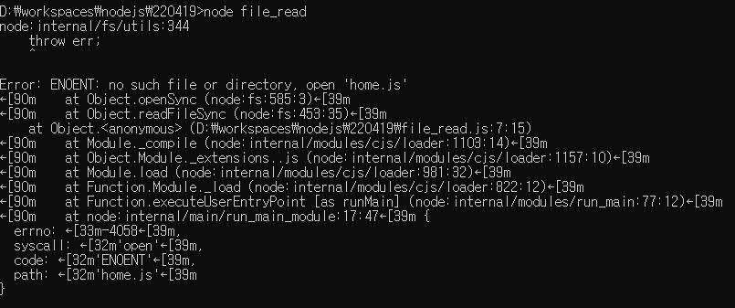
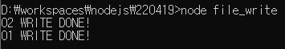
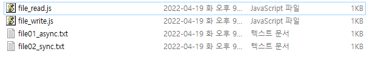
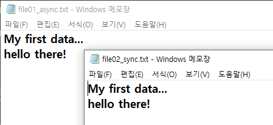

# 파일입출력

이번장에서는 node.js의 파일입출력을 다뤄본 후, 이전장에서 배운 url 모듈을 함께 사용하여 요청된 자원이 파일일 경우 해당 파일을 읽어서 클라이언트에 전달하는 로직을 작성해 보겠습니다.

node.js 는 파일을 읽고 쓰기 위해서 동기와 비동기 두 가지 형태의 함수를 제공합니다. 이벤트방식의 비동기를 지향하기 때문에 비동기 방식의 파일 읽고 쓰기가 default 입니다.


### 가. 파일 읽기

- file_read.js 파일을 생성하고 아래와 같이 입력한 후 실행합니다.


*file_read.js*

```js
// 1. fs(파일시스템) 모듈 사용
var fs = require('fs');

// 2. 비동기방식의 파일읽기. 파일을 읽은 후 마지막 파라미터에 넘긴 callback 함수가 호출
fs.readFile('home.js', 'utf-8', function(error, data) {
    console.log('01 readAsync: %s',data);
});

// 3. 동기방식의 파일읽기. 파일을 읽은 후 data 변수에 저장
var data = fs.readFileSync('home.js', 'utf-8');
console.log('02 readSync: %s',data);
```


- 소스코드에서 첫번째는 함수는 비동기방식으로 파일을 읽는 함수가 다른 thread 에 의해서 실행되기 때문에 아래와 같이 로그의 순서가 두번째 함수인 '02 readSync: ...' 가 먼저 출력됩니다.


> ❓ 코드에서는 home.js를 실행시키는 것 같은데 예제에서는 따로 만드는 과정이 없어서 나 같은 경우는 에러가 발생함.




### 나. 파일쓰기

- 이번에는 file_write.js 파일을 생성하고 아래와 같이 입력한 후 실행해 봅니다.


*file_write.js*

```js
var fs = require('fs');

// 1. 새로 생성할 파일에 입력될 문자열
var data = "My first data...\r\nhello there!";

// 2. 비동기 방식으로 파일을 생성. 함수의 인자는 앞에서 부터 순서대로 파일명, 입력데이터, 인코딩, 콜백함수
fs.writeFile('file01_async.txt', data, 'utf-8', function(e){
    if(e){
        // 3. 파일생성 중 오류가 발생하면 오류출력
        console.log(e);
    }else{
        // 4. 파일생성 중 오류가 없으면 완료 문자열 출력
        console.log('01 WRITE DONE!');
    }
});

// 5. 동기방식은 callback 함수를 통한 오류처리를 할 수 없기 때문에 함수전체를 try 문으로 예외처리
try{
    // 6. 동기 방식으로 파일을 생성. 함수의 인자는 앞에서 부터 순서대로 파일명, 입력데이터, 인코딩
    fs.writeFileSync('file02_sync.txt', data, 'utf-8');
    console.log('02 WRITE DONE!');
}catch(e){
    console.log(e);
}
```

- 역시 읽기와 마찬가지로 '02 WRITE DONE!' 로그가 먼저 출력됩니다. 해당 디렉토리를 확인해보면 file01_async.txt 와 file02_sync.txt 두개의 파일이 생성되어 있고, 파일을 열어보면 위의 소스코드에서 입력 한 'My first ...' 라는 문자열이 입력되어 있음을 확인할 수 있습니다.








### 다. 클라이언트에서 파일요청시 처리

- 이번에는 브라우저를 통해 특정 파일을 요청시 처리하는 로직을 작성해 보겠습니다.

- 먼저 요청대상이 되는 html 파일을 하나 만들고, 만들어진 html 파일을 처리해주는 server_request_file.js 파일을 같이 작성해 보겠습니다.


*hello.html*

```html
<!DOCTYPE html>
<html>
<head>
    <meta charset="UTF-8"/>
    <title>Hello node.js</title>
</head>
<body>
    <h1>Hello!</h1>
    처음 만들어보는 html 페이지 입니다.</br>
    good to see you~
</body>
</html>
```


*server_request_file.js*

```js
var http = require('http');
var url = require('url');
var fs = require('fs');

var server = http.createServer(function(request,response){
  var parsedUrl = url.parse(request.url);
  var resource = parsedUrl.pathname;

  // 1. 요청된 자원이 /hello 이면
  if(resource == '/hello'){
    // 2. hello.html 파일을 읽은 후
    fs.readFile('hello.html', 'utf-8', function(error, data) {
      // 2.1 읽으면서 오류가 발생하면 오류의 내용을
      if(error){
        response.writeHead(500, {'Content-Type':'text/html'});
        response.end('500 Internal Server Error : '+error);
      // 2.2 아무런 오류가 없이 정상적으로 읽기가 완료되면 파일의 내용을 클라이언트에 전달
      }else{
        response.writeHead(200, {'Content-Type':'text/html'});
        response.end(data);
      }
    });
  }else{
    response.writeHead(404, {'Content-Type':'text/html'});
    response.end('404 Page Not Found');
  }
});

server.listen(80, function(){
    console.log('Server is running...');
});
```


- node server_request_file 을 실행한 후 브라우저에서 http://localhost/hello를 요청하면 아래와 같이 브라우저에 출력되는 것을 확인할 수 있습니다.


- 이번에는 hello.html 의 파일명을 hello.txt 로 변경한 후 다시한번 동일한 주소를 요청해 봅니다. 그러면 아래와 같이 서버오류 메시지가 출력되는데 이는 소스코드에서 처럼 주소는 정상적으로 요청되었으나 읽으려는 파일이 없어졌기 때문에 에러를 출력하게됩니다.

